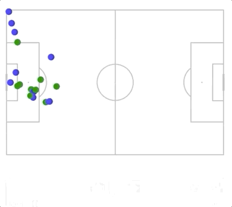

This is a simple extension of the Narya API that tries to automatically associate identified players to a team. It does so by identifying the main colors in the individual bounding boxes to then cluster across identified color combination for all bounding boxes (over multiple frames).

The results so far are not great, but I hope that this allows people to experiment with different configurations.

The main code change is in *player_ball_tracker.py* which adds the identified colors to each bounding box output.
*full_tracker_apply_corner* calls the model and does the post-processing.

